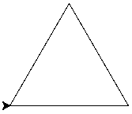
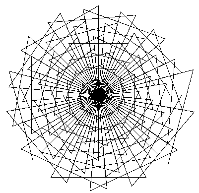
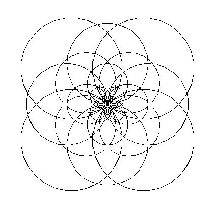
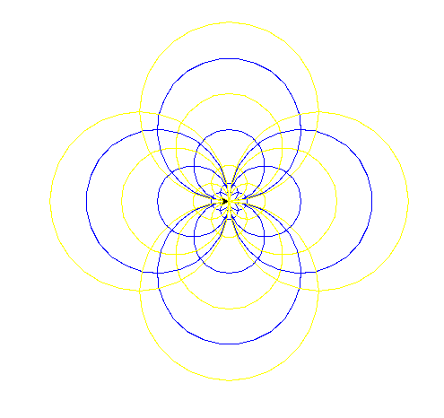
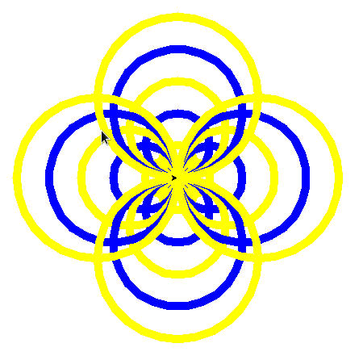
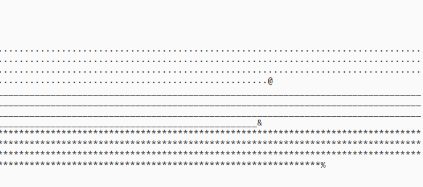
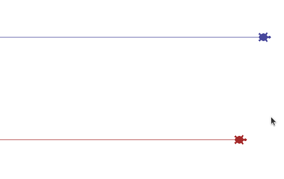
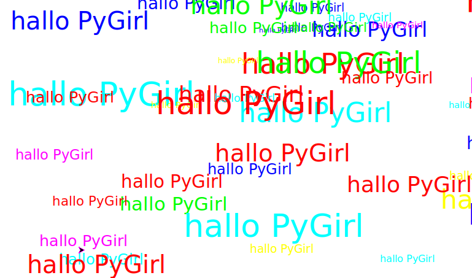
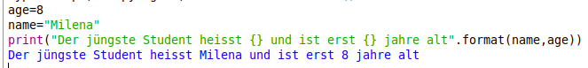

# Lesson 1
in IDLE arbeiten.
Erlernen einfacher Befehle.
## Rechnen in IDLE
 
```
5 +5 # gives 10
3-9  # gives -6

```

## Einfache Sätze schreiben

```
"Little Girl"*100
"Little Girl"*100
"Oh super Student I greet you!"*21
"Oh super Student, ich grüsse Dich"*21
print(""oh,super Student I greet you\n"*21)
```

## Import random in IDLE


```python
>>>import random

>>>random.randint(1,6)
2
>>>random.randint(1,6)
6
>>>random.randint(1,2000)
364
```

Die Frage : "Was soll ich tun, damit die letzte Zeile immer eine größere Zahl als die erste anzeigt?"


## Zeichnen eines  Dreiecks in IDLE mit turtle-Grafik

```python
import turtle
for x in range(3):
    turtle.forward(150)
    turtle.left(120)

```



## home und clear Befehle in turtle  

```python
turtle.home()
turtle.clear()
```

## Zeichnen von Blumen in IDLE mit turtle-grafik

```python
import turtle
for i in range (100):
    for x in range (3):
        turtle.forward(i*2)
        turtle.left(120)
    turtle.left(25)
```


### Blume

```python
import turtle
for r in (10,20,40,60,80,100):
    for x in range(4):
        turtle.circle(r)
        turtle.left(90)
    turtle.left(45)

```



### Blume 2 (bunter zu machen)

```python
import turtle
for r in (10,20,40,60,80,100):
    for x in range(4):
        if r in (10,40,80):
            turtle.pencolor("blue")
        else:
            turtle.pencolor("yellow")
        turtle.circle(r)
        turtle.left(90)


turtle.exitonclick()
```


### Strichstärke verändern

```pyhton
import turtle
turtle.pensize(10)
for r in (10,20,40,60,80,100):
    for x in range(4):
        if r in (10,40,80):
            turtle.pencolor("blue")
        else:
            turtle.pencolor("yellow")
        turtle.circle(r)
        turtle.left(90)


turtle.exitonclick()
```


### Strichstärke verändern

```python
import turtle
turtle.pensize(10)
for r in (100,80,60,40,20,10):
    for x in range(4):
        if r in (10,40,80):
            turtle.pencolor("blue")
            turtle.fillcolor("blue")
        else:
            turtle.pencolor("yellow")
            turtle.fillcolor("yellow")
        turtle.begin_fill()
        turtle.circle(r)
        turtle.end_fill()
        turtle.left(90)
    turtle.left(45)


turtle.exitonclick()
```


# racing game with text
```python

import random
import time

tom = "@"
jerry = "&"
cat = "%"

for step in range(100):
	motor_tom = random.randint(1,5)
	motor_jerry = random.randint(1,5)
	motor_cat = random.randint(1,5)
	
	tom = motor_tom * "." + tom
	jerry= motor_jerry*"_"+jerry
	cat=motor_cat*"*"+cat
	# make empty lines
	print("\n"*20)
	print(tom)
	print(jerry)
	print(cat)
	
	time.sleep(0.1)

```


## racing_game_text_with_different_motors


```python


import random
import time

tom = "@"
jerry = "&"

for step in range(100):
	# instruction: read in the python documentation
	# in the modul "random"
	# about the functions "randint" and "choice"
	# 1.) https://www.python.org/
	# 2.) click on "documentation" -> Python Docs https://docs.python.org/3/
	# 3.) click on "library reference" -> https://docs.python.org/3/library/index.html
	# 4.) here, press CTRL (STRG) + f at the same time to open search box
	# 5.) type in random
	# 6.) click on https://docs.python.org/3/library/random.html
	# 7.) search inside this page for "choice" and "randint" 
	motor_tom = random.randint(1,5)
	motor_jerry = random.choice([0,1,2,3,
	                             6,6,6,7])
	
	tom = motor_tom * "." + tom
	jerry = motor_jerry * "_" + jerry
	
	# make empty lines
	print("\n"*20)
	print(tom)
	print(jerry)
	
	time.sleep(0.1)

```
# racing_game_turtles

```python
import turtle
import random
import time

SCREENWIDTH = 1200
SCREENHEIGHT = 800
turtle.setup(width=SCREENWIDTH,height=SCREENHEIGHT)


tom = turtle.Turtle()
jerry = turtle.Turtle()

tom.shape("turtle")
jerry.shape("turtle")

tom.pencolor("#48489C")  # blue-grey
tom.fillcolor("#48489C")
jerry.pencolor("brown")
jerry.fillcolor("brown")

# go to starting position
tom.penup()
jerry.penup()
tom.goto(-SCREENWIDTH/2, 100)
jerry.goto(-SCREENWIDTH/2, -100)
tom.pendown()
jerry.pendown()

# start the race!
game_over = False
while not game_over:
	roll_tom = random.randint(1,6)
	roll_jerry = random.randint(1,6)
	tom.forward(roll_tom)
	jerry.forward(roll_jerry)
	time.sleep(0.25)
	# reach right screen edge ?
	if tom.pos()[0] >= SCREENWIDTH/2:
		game_over=True
		print("Tom is winner")
	if jerry.pos()[0] >= SCREENWIDTH/2:
		game_over = True
		print("Jerry is winner")


turtle.exitonclick()
```

## racing_game_turtles_drunk
```python


import turtle
import random
import time

SCREENWIDTH = 1200
SCREENHEIGHT = 800
turtle.setup(width=SCREENWIDTH,height=SCREENHEIGHT)


tom = turtle.Turtle()
jerry = turtle.Turtle()
cat = turtle.Turtle()

tom.shape("turtle")
jerry.shape("turtle")
cat.shape("turtle")

tom.pencolor("#48489C")  # blue-grey
tom.fillcolor("#48489C")
jerry.pencolor("brown")
jerry.fillcolor("brown")
cat.pencolor("orange")
cat.fillcolor("orange")

# go to starting position
tom.penup()
jerry.penup()
cat.penup()
tom.goto(-SCREENWIDTH/2, 100)
jerry.goto(-SCREENWIDTH/2, -100)
cat.goto(-SCREENWIDTH/2, 0)
tom.pendown()
jerry.pendown()
cat.pendown()

# start the race!
game_over = False
while not game_over:
	roll_tom = random.randint(1,6)
	roll_jerry = random.randint(1,6)
	roll_cat = random.randint(1,6)
	tom.forward(roll_tom)
	jerry.forward(roll_jerry)
	cat.forward(roll_cat)
	time.sleep(0.25)
	# tom is drinking...
	if random.random() < 0.2:
		tom.left(random.randint(-5,5))
	
	# reach right screen edge ?
	if tom.pos()[0] >= SCREENWIDTH/2:
		game_over=True
		print("Tom is winner")
	if jerry.pos()[0] >= SCREENWIDTH/2:
		game_over = True
		print("Jerry is winner")
	if cat.pos() [0] >= SCREENWIDTH/2:
		game_over = True
		print("Cat is winner")


turtle.exitonclick()

```


# Lesson 2


### Arbeiten in Geany mit turtle grafic

Shreibe deinen Namen

```
import turtle
turtle.write("PyGirl")

turtle.exitonclick()

```
## Arbeiten mit _random.randint_
## namerandom
```

import turtle
import random

for i in range(100):
	x = random.randint(-500,500)
	y = random.randint(-400,400)
	size = random.randint(8,40)
	color = random.choice(["#FF0000", "#00FF00",
	 "#0000FF", "#FFFF00", "#FF00FF","#00FFFF"])
	text=random.choice(["hallo PyGirl"])
	turtle.penup()
	turtle.goto(x,y)
	turtle.pendown()
	turtle.pencolor(color)
	turtle.write(text,
	             align="center",
	             font=("System", size))
   
turtle.exitonclick()
```


gives:


#  Arbeiten in Geany mit turtle grafic random.choice
## random_unicodes

Shreiben die Name

```import turtle
import random

turtle.setup(1200,800)

for i in range(150):
	x = random.randint(-600,600)
	y = random.randint(-460,460)
	size = random.randint(8,80)
	color = random.choice(["#FF0000","#FF0000",
	"#FF0000","#FF0000","#FF0000", "#00FF00",
	 "#0000FF", "#FFFF00", "#FF00FF","#00FFFF"])
	text=random.choice([#"\u2661",  # empty heart
	                    #"\u2665",  # full heart  
	                    #"\U0001F680", # rocket (does not work with font system)
	                    "\u4484",   # chinese symbol for ship
	                    ])
	turtle.penup()
	turtle.goto(x,y)
	turtle.pendown()
	turtle.pencolor(color)
	turtle.write(text,
	             align="center",
	             font=("System", size))
   
turtle.exitonclick()


```

# Arbeiten in Geany mit turtle grafic random.choice

```
import turtle
import random

turtle.setup(1200,800)

for i in range(150):
	x = random.randint(-600,600)
	y = random.randint(-460,460)
	size = random.randint(8,80)
	color = random.choice(["#FF0000","#FF0000",
	"#FF0000","#FF0000","#FF0000", "#00FF00",
	 "#0000FF", "#FFFF00", "#FF00FF","#00FFFF"])
	text=random.choice([#"\u2661",  # empty heart
	                    #"\u2665",  # full heart  
	                    #"\U0001F680", # rocket (does not work with font system)
	                    "\u4484",   # chinese symbol for ship
	                    ])
	turtle.penup()
	turtle.goto(x,y)
	turtle.pendown()
	turtle.pencolor(color)
	turtle.write(text,
	             align="center",
	             font=("System", size))
   
turtle.exitonclick()

```


# In dieser Lektion haben wir die folgenden Befehle gelernt:

* \n - Das bedeutet Zeilenwechsel (new line)
* print  - das bedeutet drucke (auf den Bildschirm)
* random.randint(1,6) - das bedeutet erzeuge eine Zufallszahl
* random.choice(["#FF0000","#00FFFF"]) - bedeutet dass ein zufälliges element _(aus einer Liste) ausgewählt wird 

# Lesson 3
## Lass es uns schreiben wir den folgenden Satz:
"Der jüngste Student heisst Milena und ist erst 8 jahre alt"

Wir werde eine neu Behfele benutzen. Es heisst ".format"

Code im IDLE:
""""
age=8
name="Milena"
print("Der jüngste Student heisst {} und ist erst {} jahre alt".format(name,age))

""""




## Python hat viel Befehl. Hier sind ein paar davon:

1. "+" plus

2. "-"  minus

3. "*"  multiplizieren

2*3
6 (2 mal 3) 
oder
"la"*3
"lalala"

4."**" potenzieren

3**4
81
gleich (3*3*3*3)

5."/" teilen

13/3
4,3333

Die Die Aufgabe:
a=2
a=a*3
a=?

a=2
a=2-5
a=?

1+(5*2)
(1+5)*2

## Schachbret Reiskorn Geschichte
Es war einmal ein König, der hatte einen sehr weisen Berater.

Der König fragte den Berater, wie er ihn belohnen kann.

Der Berater sagte, er will ein Schachbrett voller Reiskörner.

"Das ist alles?" fragte der König.

"Mit einer bestimmten Bedingung" antortete der Berater. "Lege mir auf das erste Feld des Schachbretts ein einziges Reiskorn. Lege mir auf das zweite Feld des Schachbretts zwei Reiskörner. Lege mir auf das dritte Feld des Schachbretts vier Reiskörner. Und so weiter, jedes Feld soll doppelt so viele Reiskörner bekommen wie das vorige Feld, bis das ganze Schachbrett voll ist."

"Das ist einfach!" sagte der König und freute sich, dass er den Berater so billig bezahlen kann.

Der Berater lächelte nur.

## Fragen
- Wie viele Felder hat ein Schachbrett?
- Wie viel wiegt ein Reiskorn?
- Wie viele Reiskörner sind in einem kg Reis?
- Wie viele kg Reis muss der König zahlen?
- Wie viel kostet ein kg Reis?
- Wie viele Reiskörner muss der König zahlen?

- Wie viel Geld muss der König zahlen für den Reis?


## Antworten

- Ein Schachbrett hat 8x8 = 64 Felder
- Ein Reiskorn wiegt circa 0.025 Gramm
- Ein Kg Reis enthält circal 1000 / 0.025 = 40.000 Reiskörner
- Wieviele Reiskörner braucht der König um den Berater zu bezahlen?
 -- 18 Trillionen 

 - Wie viel Kg? 18000000000000000000/40000 = 450 Billionen kg

 - Geld? für 2 Euro pro kg:
 900 Billionen  EURO
 usa: 19.71 billionen


