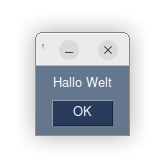
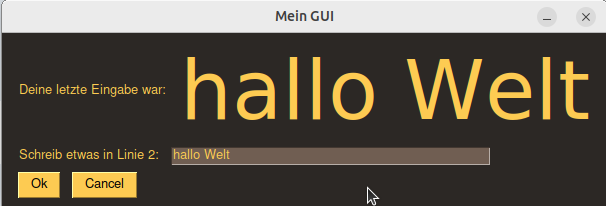

# würfelspiel mit PySimpleGUI 

### Was ist PySimpleGUI ?

PySimpleGUI ist eine Python-Bibliothek die es einfach macht, mit Python ein GUI zu programmieren.

### Was ist ein GUI ?

GUI ist eine englische Abkürzung für **G**raphical  **U**ser **I**nterface, auf deutsch: grafische Benutzeroberfläche. 

Jedes moderne Programm welches Eingabefelder, Buttons oder Schieberegler hat die man mit der Maus bedienen kann hat ein GUI. 

# Vorbereitung

PySimpleGUI ist standardmäßig NICHT mit Python mitinstalliert, man muss es extra auf jedem Computer installieren.

## testen ob PySimpleGUI installiert ist und funktioniert

Am besten die IDLE öffnen (oder ein kleines Python Programm schreiben) mit folgenden Zeilen:
```python
>>>import PySimpleGUI as sg
>>>sg.PopupOK("Hallo Welt")
```
Wenn PySimpleGUI richtig installiert ist escheint folgendes Fenster:



Ansonsten erscheint eine Fehlermeldung.

## PySimpleGUI installieren 

Zum installieren von PySimpleGUI muß Python korrekt installiert sein und der Computer muss eine Internetverbindung haben.

* Ein Terminal öffnen und dort eintippen:
  ```
  pip3 install pysimplegui
  ```
## offizielle PySimpleGUI Website

Die offizielle Website zu PySimpleGUI ist in englischer Sprache. Wir brauchen von dort folgende 3 Dinge:

### Die Farbtafel:

https://www.pysimplegui.org/en/latest/#themes-automatic-coloring-of-your-windows


_Hinweis_: lässt sich auch erzeugen von idle aus mit diesen Zeilen:
```python
>>>import PySimpleGUI as sg
>>>sg.theme_previewer()
```

### Das Beispielprogramm

Das "Jump-start" Beispielprogramm (hier ins Deutsche übersetzt und leicht verändert):
* original: <https://www.pysimplegui.org/en/latest/#jump-start>
* diese Version: [jumstart_de.py](jumpstart_de.py)

```python
import PySimpleGUI as sg

sg.theme('DarkAmber')   # Farbschema

# Das Layout ist eine Liste mit Listen. 
# Jede innere Liste ist eine GUI-Zeile 
layout = [ 
    [sg.Text('Deine letzte Eingabe war:'),
     sg.Text("...", key="text1", font=("System", 64))],
    [sg.Text('Schreib etwas in Linie 2:'), sg.InputText(key="antwort1", )],
    [sg.Button('Ok', bind_return_key=True),  sg.Button('Cancel')],
]

# Fenstertitel und Layout festlegen:
window = sg.Window('Mein GUI', layout)
# Die Endlosschleife erzeugt 'events' und alle Eingabefelder erzeugen 'values' 
while True:
    event, values = window.read()
    if event == sg.WIN_CLOSED or event == 'Cancel': 
        break
    if event == "Ok": 
        usertext = values["antwort1"] # oder values[0]
        window["text1"].update(f"{usertext}")

window.close()
```
ergibt dieses Fenster:


## Die Call Referenz:

Folgende Website öffnen, wir werden sie noch oft brauchen:

* <https://www.pysimplegui.org/en/latest/call%20reference/>


# Würfelspiel: Spielregeln erklären

In Wikipedia wird das Würfelspiel Yatzee sehr gut erklärt. Es gibt ähnliche Varianten, z.B. Yacht oder Pokerwürfeln.

In diesen Spielen geht es darum mit insgesamt 5 Würfeln eine gute Zahlenkombination zu erzielen, wobei jeder Spieler 3 x hintereinander würfeln darf. Bei jedem Wurf kann er einige Würfel liegenlassen oder alle Würfel neu werfen.

Hier sind die genauen Spielregeln für die Spielvariante "Yatzee" bzw. "Kniffel:

* <https://de.wikipedia.org/wiki/Kniffel>


nächstes Kapitel: [Kapitel 2](kapitel02.md)
