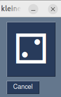

# würfelspiel mit PySimpleGUI 


# erste Schritte mit PySimpleGUI 

Zum Anfangen eignen sich die Popup-Befehle von PySimpleGUI hervorragend. Jeder dieser Befehle erzeugt ein kleines GUI Fenster.

In der Call Referece sind die Popup-Befehle hier zu finden:
* <https://www.pysimplegui.org/en/latest/call%20reference/#popups-pep8-versions>

Entweder in Idle jeweils eine Zeile schreiben oder im Code-Editor ein kleines Python Programm schreiben:

Download: [brav.py](brav.py)
```python
import PySimpleGUI as sg
sg.PopupOK("Guten Tag")
name = sg.popup_get_text("Wie heißt Du?")
brav = sg.PopupYesNo(f"Warst Du brav, {name} ?")
if brav == "Yes":
    sg.PopupOK("Sehr brav!")
else:
    sg.PopupOK("Schlimmes Kind!")
```


#kleines würfelspiel programm 

Die Aufgabe dieses Programms ist es den Schülern zu zeigen wie ein "echtes" PySimpleGUI - Programm funktioniert.
Das Programm soll einen Button haben der einen Würfel darstellt. Wenn er geklickt wird soll er eine Zufallszahl anzeigen.

### würfelspiel1.py

Download: [würfelspiel1.py](würfelspiel1.py)


```python
# zeigt einen Button der eine Zufallszahl anzeigt

import random
import PySimpleGUI as sg

layout = [
    [sg.Button("?", key="w1", font=("System",64))],
    [sg.Button("Cancel")],
]

window = sg.Window("kleines Programm", layout)

while True:
    event, values = window.read()
    if event in ("Cancel", sg.WIN_CLOSED):
        break
    if event == "w1":
        zahl = random.randint(1,6)
        window["w1"].update(text=f"{zahl}")
window.close()
```

# Würfel anzeigen mit Unicode
Wir erstellen ein Dictionary welches als **keys** die Zahlen von 1 bis 6 hat und als **values** die entsprechenden Unicode-Zeichen für Würfelseiten

Die Unicode-Nummern findet man z.B. hier:
<https://en.wikipedia.org/wiki/List_of_Unicode_characters#Miscellaneous_Symbols>

Die Unicode Nummern für die Würfelseiten 1 bis 6 sind 2680 bis 2685

Wir fügen unter dem import Befehl folgenden Code ein:

```python
codes = {1:"\u2680",
         2:"\u2681",
         3:"\u2682",
         4:"\u2683",
         5:"\u2684",
         6:"\u2685",
         }
```

und ändern Zeile 19 folgendermaßen:

```python
        window["w1"].update(text=f"{codes[zahl]}")
```
### würfelspiel2.py

Das geänderte Programm speichern wir ab als [würfelspiel2.py](würfelspiel2.py):



```python
# zeigt einen Button der einen Zufallswürfel anzeigt

import random
import PySimpleGUI as sg

codes = {1:"\u2680",
         2:"\u2681",
         3:"\u2682",
         4:"\u2683",
         5:"\u2684",
         6:"\u2685",
         }

layout = [
    [sg.Button("?", key="w1", font=("System",64))],
    [sg.Button("Cancel")],
]

window = sg.Window("kleines Programm", layout)

while True:
    event, values = window.read()
    if event in ("Cancel", sg.WIN_CLOSED):
        break
    if event == "w1":
        zahl = random.randint(1,6)
        window["w1"].update(text=f"{codes[zahl]}")
window.close()
```

_voriges Kapitel: [Kapitel 1](kapitel01.md)_ 
_nächstes Kapitel: [Kapitel 3](kapitel03.md)_