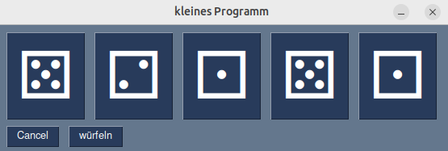
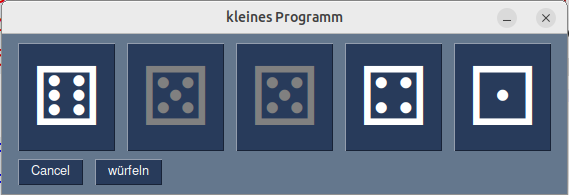

# würfelspiel mit PySimpleGUI


# Fünf Würfel nebeneinander

Das kleine Programm Variante2  wird jetzt erweitert um insgesamt 5 Würfel nebeneinander anzuzeigen. Außerdem machen wir neben den Cancel Button einen Button der alle 5 Würfel gleichzeitig würfelt.

Anstatt den If-Block in Zeile 30 viermal zu kopieren nutzen wir die Tatsache daß der event für jeden Button ein String ist... der selbe String wie der key-Parameter für die Buttons!

### würfelspiel3.py

Download: [würfelspiel3.py](würfelspiel3.py)



```python
# zeigt fünf Buttons mit Zufallswürfeln 

import random
import PySimpleGUI as sg

codes = {1:"\u2680",
         2:"\u2681",
         3:"\u2682",
         4:"\u2683",
         5:"\u2684",
         6:"\u2685",
         }

layout = [
    [sg.Button("?", key="w1", font=("System",64)),
     sg.Button("?", key="w2", font=("System",64)),
     sg.Button("?", key="w3", font=("System",64)),
     sg.Button("?", key="w4", font=("System",64)),
     sg.Button("?", key="w5", font=("System",64)),     
    ],
    [sg.Button("Cancel"), sg.Button("würfeln")],
]

window = sg.Window("kleines Programm", layout)

while True:
    event, values = window.read()
    if event in ("Cancel", sg.WIN_CLOSED):
        break
    if event in ("w1","w2","w3","w4","w5"):
        zahl = random.randint(1,6)
        window[event].update(text=f"{codes[zahl]}")
    if event == "würfeln":
        for w in ("w1","w2","w3","w4","w5"):
            zahl = random.randint(1,6)
            window[w].update(text=f"{codes[zahl]}")
window.close()
```

# Würfel sperren

Die if-Blocks in Zeile 30 und in Zeile 33 sind sich sehr ähnlich...sie sind fast identisch. (Fast) identischer Code ist etwas das gute Programmierer vermeiden. Einerseits weil er schlicht nicht elegant ist, andererseits weil er fehleranfällig ist - wenn man etwas korrigieren muss dann ist diese Korrektur an mehreren Stellen notwendig und das Risiko ist groß daß man die Korrektur an einer Stelle vergisst. 

Wir lösen das Proglem des (fast) identischen Codes indem wir das Design des GUI's verändern: Anstatt jeden einzelnen Würfel anklicken zu können um ihn neu zu würfeln (die Buttons w1 bis w6) und zusäztlich einen Button zu haben der alle Würfel neu würfelt machen wir folgendes:

Wenn man einen einzelnen Würfel anklickt wird dieser gesperrt. Klickt man ihn nochmal an, wird die Sperre aufgehoben. 
Der "würfeln" Button würfelt alle Würfel die nicht gesperrt sind.

Wir basteln dazu noch ein Dictionary namens gesperrt mit den key-strings der Würfeln als keys und mit True/False Werten als values:

```python
gesperrt = {"w1":False,
            "w2":False,
            "w3":False,
            "w4":False,
            "w5":False,
            }
```
und fügen es unterhalb des _codes_ dictionarys ein.

Gleich darunter speichern wir die beiden Button-Farben des aktuellen Farbschemas (theme):
```python
bgcolor = sg.theme_button_color_background()
color = sg.theme_button_color_text()
```


Außerdem verändern wir die beiden if-Blöcke:
```python
    if event in gesperrt.keys():
        gesperrt[event] = not gesperrt[event]
        if gesperrt[event]:
            window[event].update(button_color=("grey", bgcolor))
        else:
            window[event].update(button_color=(color, bgcolor))
    if event == "würfeln":
        for w in gesperrt.keys():
            if gesperrt[w]:
                continue
            zahl = random.randint(1,6)
            window[w].update(text=f"{codes[zahl]}")
```

Hier  passiert mehreres: Anstatt zu testen ob der event in ("w1", "w2", "w3" etc. ) liegt verwenden wir gesperrt.keys(). Die Zeile ```gesperrt[event] = not gesperrt[event]``` schaltet im gesperrt dictionary die Values um, jeweils von True auf False und umgekehrt. Ein gesperrter Button bekommt danach im update Befehl eine graue Schriftfarbe und wird beim "würfeln" ignoriert.


Das veränderte Programm bekommt den Namen würfelspiel4.py

### würfelspiel4

Download: [würfelspiel4.py](würfelspiel4.py)



```python
# zeigt fünf Buttons mit Zufallswürfeln die sich sperren lassen

import random
import PySimpleGUI as sg

codes = {1:"\u2680",
         2:"\u2681",
         3:"\u2682",
         4:"\u2683",
         5:"\u2684",
         6:"\u2685",
         }

gesperrt = {"w1":False,
            "w2":False,
            "w3":False,
            "w4":False,
            "w5":False,
            }

bgcolor = sg.theme_button_color_background()
color = sg.theme_button_color_text()

layout = [
    [sg.Button("?", key="w1", font=("System",64)),
     sg.Button("?", key="w2", font=("System",64)),
     sg.Button("?", key="w3", font=("System",64)),
     sg.Button("?", key="w4", font=("System",64)),
     sg.Button("?", key="w5", font=("System",64)),     
    ],
    [sg.Button("Cancel"), sg.Button("würfeln")],
]

window = sg.Window("kleines Programm", layout)

while True:
    event, values = window.read()
    if event in ("Cancel", sg.WIN_CLOSED):
        break
    if event in gesperrt.keys():
        gesperrt[event] = not gesperrt[event]
        if gesperrt[event]:
            window[event].update(button_color=("grey", bgcolor))
        else:
            window[event].update(button_color=(color, bgcolor))
    if event == "würfeln":
        for w in gesperrt.keys():
            if gesperrt[w]:
                continue
            zahl = random.randint(1,6)
            window[w].update(text=f"{codes[zahl]}")
window.close()
```

_voriges Kapitel: [Kapitel 2](kapitel02.md)_ 
_nächstes Kapitel: [Kapitel 4](kapitel04.md)_
